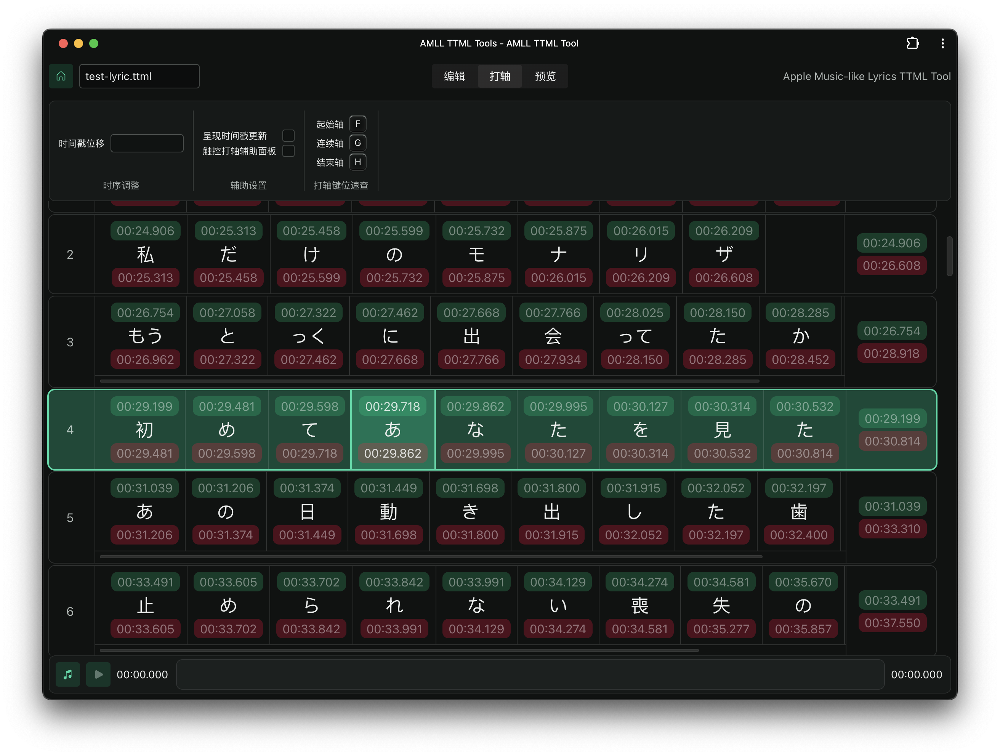
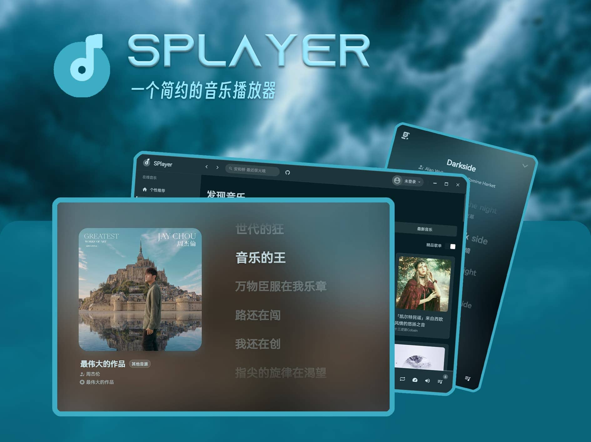
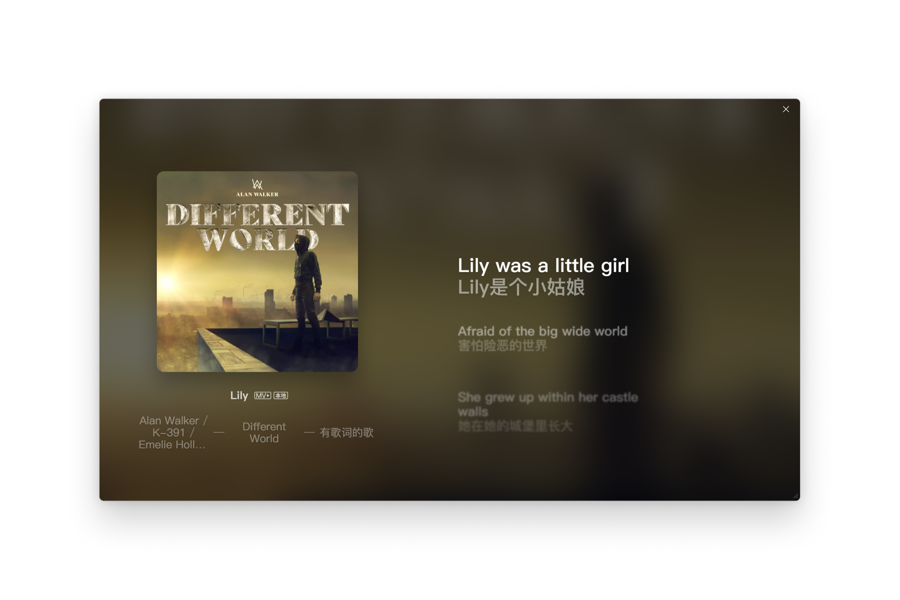

After continuous development, AMLL has built an open-source ecosystem around word-by-word lyrics, including lyric databases, editors, and music players.

## First-party Ecosystem

First-party projects are repositories under the [amll-dev](https://github.com/amll-dev/) GitHub organization. Content and docs for each project are maintained independently. Please report issues in the corresponding repository.

### AMLL TTML Database

[AMLL TTML Database](https://github.com/amll-dev/amll-ttml-db) is a high-quality open word-by-word lyrics database. Lyrics are community-contributed and reviewed, and published under [CC0-1.0](https://github.com/amll-dev/amll-ttml-db/blob/main/LICENSE).

If you are building a player, you can use it as your lyric source. You can also contribute lyrics back to the database. For submission and usage details, see its [repository wiki](https://github.com/amll-dev/amll-ttml-db/wiki).

### AMLL TTML Tool

[AMLL TTML Tool](https://github.com/amll-dev/amll-ttml-tool) is a React-based word-by-word lyrics editor with lyric editing and timing capabilities. Most lyrics in the database were created using this tool.

It is deployed at <https://tool.amll.dev/> and can be used directly.

### AMLL Editor

[AMLL Editor](https://github.com/amll-dev/amll-editor) is a next-generation Vue-based word-by-word lyrics editor, currently in early development. Compared with AMLL TTML Tool, it introduces additional conveniences such as find and replace.

It is deployed at <https://editor.amll.dev/> and can be used directly. Documentation is available in its [repository wiki](https://github.com/amll-dev/amll-editor/wiki).

### AMLL Player

[AMLL Player](https://github.com/amll-dev/amll-player) is a music player built on AMLL. It can be used as a local music player, or together with WS protocol to integrate with other music software.

## Recommended Third-party Projects

Here are selected third-party applications integrating AMLL. Because of GPL copyleft, these projects are also open-source under GPL and available for free use. We also maintain a [GitHub discussion](https://github.com/orgs/amll-dev/discussions/397).

### SPlayer

[SPlayer](https://github.com/imsyy/SPlayer) is a third-party NetEase Cloud Music client built with Vue.

## History

AMLL was born in [December 2022](https://github.com/amll-dev/applemusic-like-lyrics/commit/88a3c1d), initially as a BetterNCM plugin for NetEase Cloud Music PC client to enhance lyric UI.

In July 2023, AMLL released its first npm package [@applemusic-like-lyrics/core@0.0.1](https://www.npmjs.com/package/@applemusic-like-lyrics/core/v/0.0.1).

Due to multiple client limitations and performance issues in NetEase Cloud Music, AMLL Player development started in [August 2023](https://github.com/amll-dev/applemusic-like-lyrics/commit/28d3f6f). It communicates with clients through a WebSocket-based protocol and moved lyric rendering into an independent application.

In February 2024, the plugin released its final version [v3.1.0](https://github.com/amll-dev/applemusic-like-lyrics/releases/tag/v3.1.0), ending plugin-mode development and maintenance. Later, plugin UI parts were reorganized into reusable component libraries.

In September 2024, components from the original plugin were released as [@applemusic-like-lyrics/react-full@0.2.0-alpha.0](https://www.npmjs.com/package/@applemusic-like-lyrics/react-full/v/0.2.0-alpha.0).

In April 2026, AMLL Player was [split out](https://github.com/amll-dev/applemusic-like-lyrics/pull/455) from the main repository into an [independent repository](https://github.com/amll-dev/amll-player), and an automated release workflow was introduced. Through GitHub Actions, the first provenance package [@applemusic-like-lyrics/core@0.3.0](https://www.npmjs.com/package/@applemusic-like-lyrics/core/v/0.3.0) was published.

AMLL is still under active development. Contributions are welcome. See [Contributing](/en/contribute).
